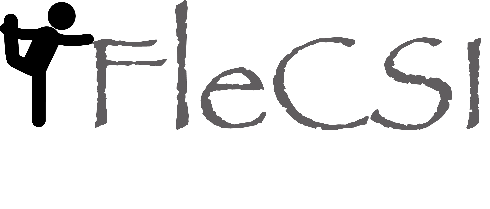

# Introduction

FleCSI is a compile-time configurable framework designed to support
multi-physics application development. As such, FleCSI provides a very
general set of infrastructure design patterns that can be specialized
and extended to suit the needs of a broad variety of solver and data
requirements. FleCSI currently supports multi-dimensional mesh topology,
geometry, and adjacency information, as well as n-dimensional
hashed-tree data structures, graph partitioning interfaces, and
dependency closures.

FleCSI introduces a functional programming model with control,
execution, and data abstractions that are consistent both with MPI and
with state-of-the-art, task-based runtimes such as Legion and Charm++.
The abstraction layer insulates developers from the underlying runtime,
while allowing support for multiple runtime systems including
conventional models like asynchronous MPI.

The intent is to provide developers with a concrete set of user-friendly
programming tools that can be used now, while allowing flexibility in
choosing runtime implementations and optimizations that can be applied
to future architectures and runtimes.

FleCSI's control and execution models provide formal nomenclature
for describing poorly defined concepts such as kernels and tasks.
FleCSI's data model provides a low-buy-in approach that makes it an
attractive option for many application projects, as developers are
not locked into particular layouts or data structure representations.

# Documentation

Documentation for FleCSI is at
[flecsi.org](http://laristra.github.io/flecsi).

# Release

This software has been approved for open source release and has
been assigned **LA-CC-16-022**.

# Copyright

Copyright (c) 2016, Triad National Security, LLC.
All rights reserved.

This program was produced under U.S. Government contract 89233218CNA000001 for
Los Alamos National Laboratory (LANL), which is operated by Triad National
Security, LLC for the U.S. Department of Energy/National Nuclear Security
Administration.

All rights in the program are reserved by Triad National Security, LLC, and the
U.S. Department of Energy/National Nuclear Security Administration. The
Government is granted for itself and others acting on its behalf a
nonexclusive, paid-up, irrevocable worldwide license in this material to
reproduce, prepare derivative works, distribute copies to the public, perform
publicly and display publicly, and to permit others to do so.

Additionally, redistribution and use in source and binary forms, with or
without modification, are permitted provided that the following conditions are
met:

1. Redistributions of source code must retain the above copyright notice,
   this list of conditions and the following disclaimer.
2. Redistributions in binary form must reproduce the above copyright
   notice, this list of conditions and the following disclaimer in the
   documentation and/or other materials provided with the distribution.
3. Neither the name of Los Alamos National Security, LLC, Los Alamos
   National Laboratory, LANL, the U.S. Government, nor the names of its
   contributors may be used to endorse or promote products derived from this
   software without specific prior written permission.

THIS SOFTWARE IS PROVIDED BY Triad National Security, LLC. AND CONTRIBUTORS "AS
IS" AND ANY EXPRESS OR IMPLIED WARRANTIES, INCLUDING, BUT NOT LIMITED TO, THE
IMPLIED WARRANTIES OF MERCHANTABILITY AND FITNESS FOR A PARTICULAR PURPOSE ARE
DISCLAIMED. IN NO EVENT SHALL Triad National Security, LLC. OR CONTRIBUTORS BE
LIABLE FOR ANY DIRECT, INDIRECT, INCIDENTAL, SPECIAL, EXEMPLARY, OR
CONSEQUENTIAL DAMAGES (INCLUDING, BUT NOT LIMITED TO, PROCUREMENT OF SUBSTITUTE
GOODS OR SERVICES; LOSS OF USE, DATA, OR PROFITS; OR BUSINESS INTERRUPTION)
HOWEVER CAUSED AND ON ANY THEORY OF LIABILITY, WHETHER IN CONTRACT, STRICT
LIABILITY, OR TORT (INCLUDING NEGLIGENCE OR OTHERWISE) ARISING IN ANY WAY OUT
OF THE USE OF THIS SOFTWARE, EVEN IF ADVISED OF THE POSSIBILITY OF SUCH DAMAGE.

<!-- vim: set tabstop=2 shiftwidth=2 expandtab fo=cqt tw=72 : -->
