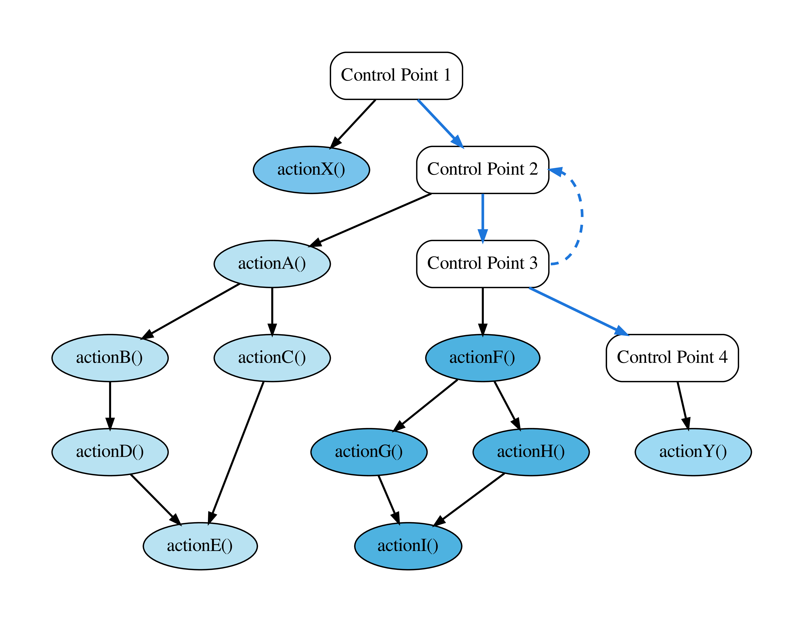
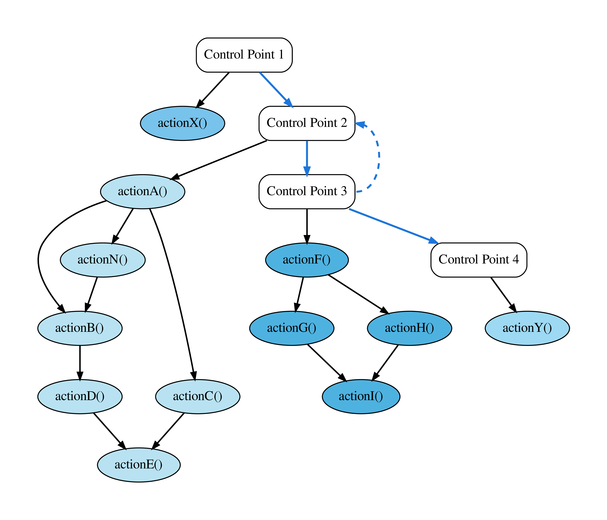
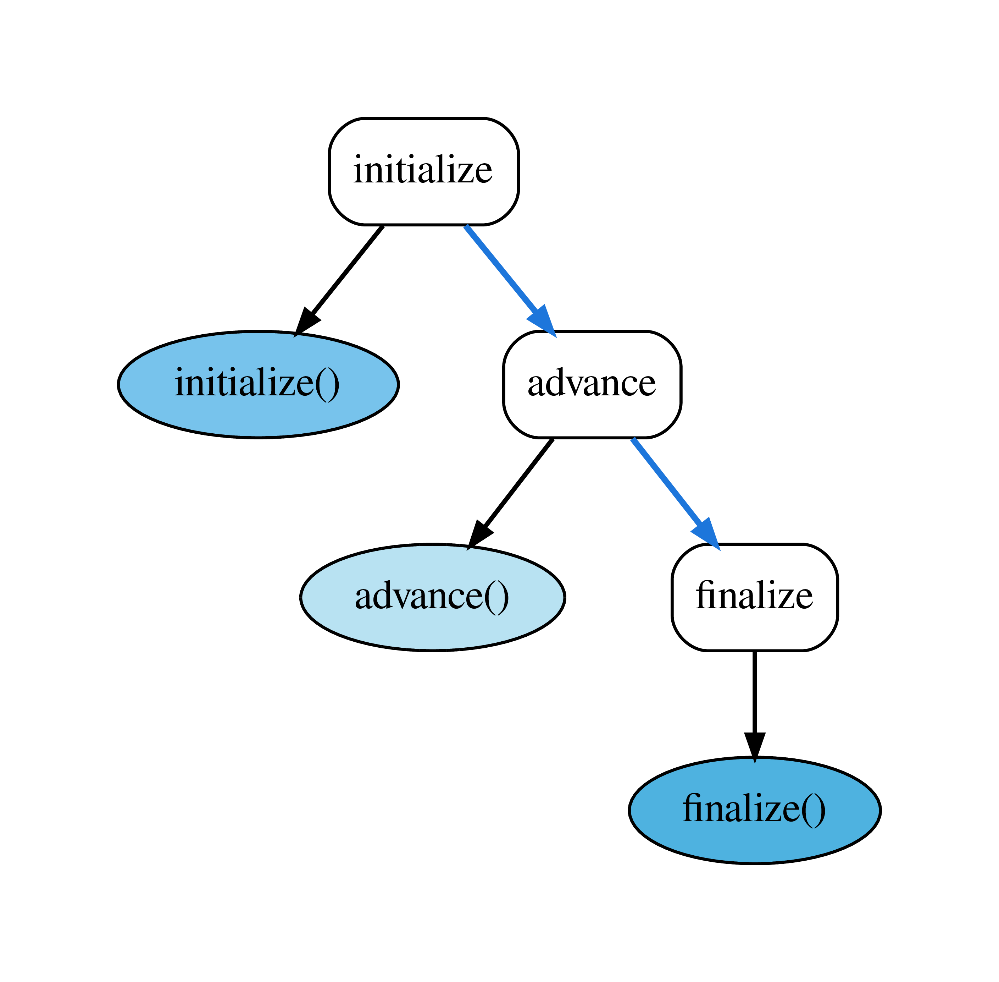
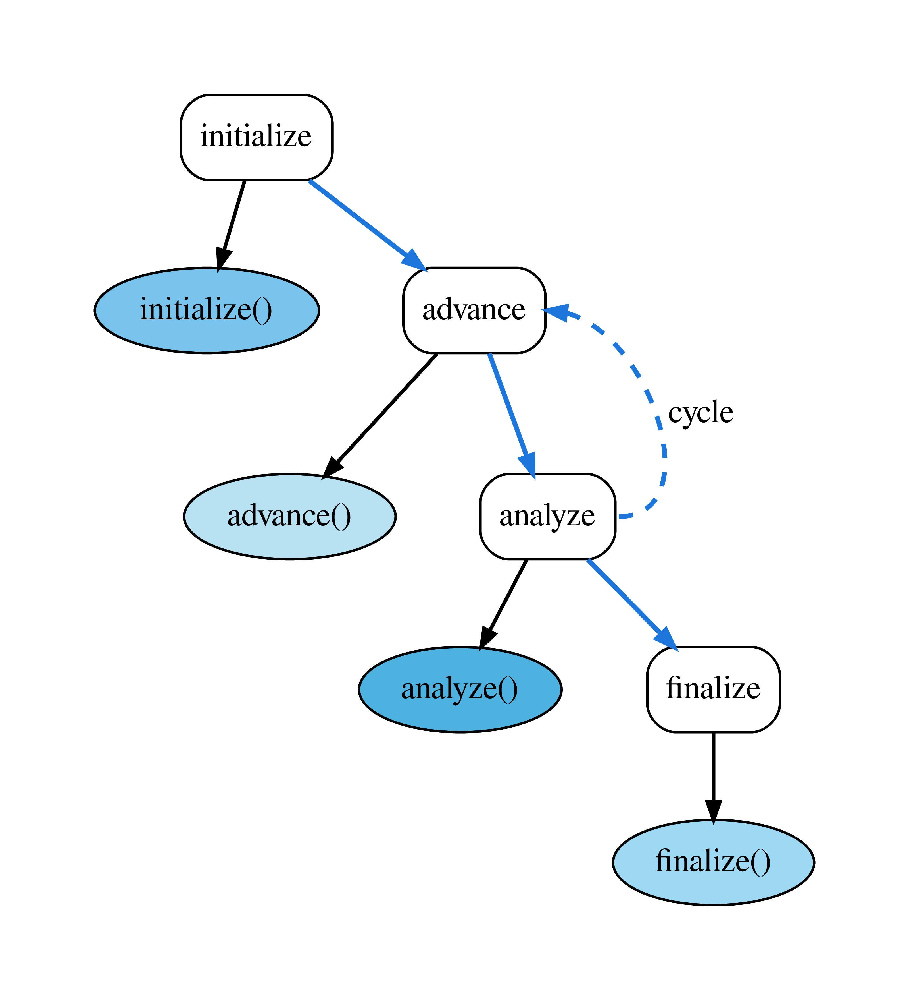
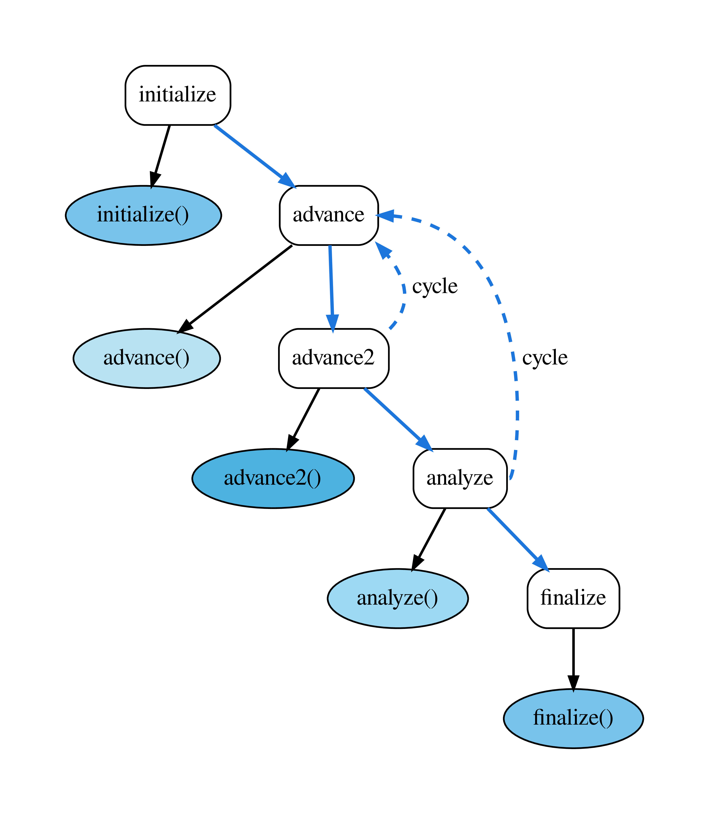

.. |br| raw:: html

    

.. _TUT-CM:

Control Model
*************

The FleCSI control model allows users to define the high-level structure
of an application using a control-flow graph (CFG) of *control points*,
under each of which, a directed acyclic graph (DAG) of *actions* can be
defined.

.. sidebar:: Control Points & Actions

   **Control Points** are the logical steps in a control-flow graph.
   These are not actual execution units. However, they define named
   anchors where actions can be registered that will be executed when
   the control-flow graph reaches that control point.

   **Actions** are the C/C++ functions that are executed under a control
   point.

For FleCSI developers, the control model replaces the normal hard-coded
execution structure of an application, instead providing a well-defined,
extensible mechanism, which can easily be verified, and visualized.

Consider the following example of a traditional *implicit* control
model:

.. code-block:: cpp

   int main(int argc, char ** argv) {
     int step{0}, steps{0};

     // initialization stage
     initialize(steps);

     while(step<steps) {
       // simulation stages
       advanceA();
       advanceB();
       advanceC();

       // analysis stages
       analyzeA();
       analyzeB();
       analyzeC();
     } // while

     // finalization stage
     finalize();
   } // main

While this example is straightforward, it is also restrictive because it
defines a single point in the application where all stages must be
known.
Suppose that an advanced user would like to add an *advance* or
*analysis* stage to the simulation, e.g, to test a new algorithm, or to
customize their metrics?
With the traditional model above, she would need to have access to the
code base, and would have to rewrite the main simulation loop with the
new execution logic.
This is error prone, and worse, it necessarily forces the code to
diverge (unless every alteration to the application is vetted and
merged).

FleCSI's control model offers a much cleaner solution, which is both
easier for the user, and safer for the core application developers.
There are other advantages for advanced users and core application
developers that should become apparent from the tutorial examples.

----

Control-Flow Graphs & Directed Acyclic Graphs
+++++++++++++++++++++++++++++++++++++++++++++

:numref:`cfg` shows a complete representation of a FleCSI control model.
This figure was actually generated by a FleCSI example application using
the ``--control-model`` flag, which outputs a dot file of the control
model.
The white control-point nodes in the figure (labeled: *Control Point X*)
define a control-flow graph. Notice that the control points do not form
a DAG, i.e., they cycle (indicated by the dashed line from *Control
Point 3* to *Control Point 2*).
This is true, in general, and allows users to create complex looping
structures within their applications.

At each control point in the CFG, there are one or more actions defined,
e.g., under *Control Point 2* are the actions *A* through *E*.
The actions are where the actual work of the simulation is executed.

.. important::

   The actions in a FleCSI control model are not tasks! The control
   model capability in FleCSI is orthogonal to Legion's tasking model,
   i.e., they are complementary. **FleCSI actions are functions that
   execute tasks!** When the Legion backend to FleCSI is in use, the
   control model exposes a sequential program order to the Legion
   runtime that can be analyzed for data dependencies to increase
   concurrency, and allow load balancing during execution.

.. MAINTAINER NOTE: The image for this figure was generated by the
   control-overview program that is located in
   'flecsi/tutorial/.auxiliary/control-overview'.
.. _cfg:

   Example FleCSI Control Model.

.. sidebar:: Sequential Ordering

   .. _sequential:
   .. figure:: images/sequential.png
      :align: center
      :width: 70%

      A valid ordering of :numref:`cfg`.

It is important to notice that actions have dependencies, and that they
are DAGs.
This allows the FleCSI runtime to topologically sort the actions into a
single valid sequential ordering.
This ordering uses the fact that the control point order is defined by a
specialization of the core FleCSI control type.
FleCSI then sorts each DAG of actions to create the overall sequential
ordering (:numref:`sequential`).
This ordering is non-unique, but is deterministic for a given FleCSI
control model, i.e., the same code and compiler version will generate
the same ordering every time.
:numref:`sequential` was also generated by a FleCSI example program by
passing the ``--control-model-sorted`` flag.

----

FleCSIbility
++++++++++++

Another important attribute of the FleCSI control model is that actions
and dependencies do not need to be defined in a centralized location in
the code.
This adds significant flexibility in extending the actions that a
simulation executes.

Let's consider our advanced user who would like to add a new action:
Because FleCSI does not force her to add actions to a static loop, she
can instead put it in a source file that only needs to link to the
control points definition of the application.
She still has to build an application driver. However, if the
application packages are primarily developed as libraries, this is easy
to do.

Without going into the specific details yet, inserting a new action *N*
under *Control Point 2* would look something like this:

.. code-block:: cpp

  control::action<actionN, cp::two> action_n;
  const auto dep_na = action_n.add(action_a);
  const auto dep_bn = action_b.add(action_n);

That's it!
This will insert a new action that depends on action *A*, and which is
depended upon by action *B* (:numref:`extension`).
Because of FleCSI's data model, any data dependencies will automatically
be honored by the runtime.
For example, if action *N* modifies a pressure field that is used by
action *B*, the underlying runtime will recognize this dependency, and
the data will be consistent.
This code can also be in its own source file, which means that the
original package does not need to be modified.
Of course, the core application developers need to document the control
point identifiers, and actions, so that our advanced user knows the
correct names to use.
However, this is a small cost to allow easy experimentation and
extension of the application.

.. _extension:

   Control Model After Extension.

----

Examples
++++++++

The rest of this tutorial demonstrates how application developers can
use the FleCSI control model to create extensible applications.
We begin with an extremely simple control model, but quickly build to a
more realistic example.

.. attention::

  This tutorial breaks our convention of avoiding details of the FleCSI
  specialization layer (We lied to you in the tutorial introduction!).
  This is necessary to demonstrate how the code for this example works.
  In general, the control model for an application will be defined by
  the specialization developer, with a fixed set of documented control
  points that are not modifiable by the application developer. Users of
  the specialization (application developers) will add actions that
  define the substance of the simulation.

----

Example 1: Simple
+++++++++++++++++

This example will show you how to construct the simplest non-trivial
control model that might make sense for an application. :numref:`simple`
shows the control model, which has three control points (*initialize*,
*advance*, and *finalize*) with one action under each. This is still not
a very useful example because it lacks cycles (introduced in the next
example). However, it will serve to introduce the definition of a
control model from the core FleCSI type.

.. _simple:

   Control Model for Example 1.

.. tip::

  This example introduces the notion of a policy type. Policies are C++
  types (structs or classes) that can be used to define the behavior of
  another templated C++ type. This design pattern was introduced by
  Andrei Alexandrescu in `Modern C++ Design`__. The details of the
  design pattern are not important to this example, but may make
  interesting reading. For our purposes, a policy is simply a C++ struct
  that we pass to the core control type.

  __ https://en.wikipedia.org/wiki/Modern_C%2B%2B_Design

Defining Control Points
^^^^^^^^^^^^^^^^^^^^^^^

The first thing about a control model is the control points. To define
these, we use an enumeration. Consider the following from
*tutorial/2-control/1-simple.hh*:

.. literalinclude:: ../../../../tutorial/2-control/1-simple.hh
  :language: cpp
  :lines: 21-26

The name of the enumeration (*cp*) is arbitrary.
However, it is useful to make it concise because it will be used in the application code (This is not precisely true because the specialization developer may choose to define helper types for registering actions, but it is true for this example.)
At any rate, the name is not important because it will be used as a type
definition in our control policy.

In addition to the enumeration itself, we also define an operator
overload of the *\** operator (function call operator overloading):

.. literalinclude:: ../../../../tutorial/2-control/1-simple.hh
  :language: cpp
  :lines: 28-46

Perhaps this looks complicated, but really all it does is to return a
string literal given one of the control point enumeration values defined
in *cp*.
This approach is used by FleCSI because it is safer than defining a
static array of string literals.
The labels are used to create visualizations of the control model.

The following defines the actual control policy (We will discuss the
individual parts.):

.. literalinclude:: ../../../../tutorial/2-control/1-simple.hh
  :language: cpp
  :lines: 47-90

The first type definition in the policy captures the control points
enumeration type. This type is used in the control interface for
declaring actions:

.. literalinclude:: ../../../../tutorial/2-control/1-simple.hh
  :language: cpp
  :lines: 57-62

The next type is the *node_policy*. Each set of actions under a control
point forms a DAG. Specifying a non-trivial node policy allows the user
to add additional interfaces and data to an action. In this simple
example, the node type is empty:

.. literalinclude:: ../../../../tutorial/2-control/1-simple.hh
  :language: cpp
  :lines: 64-71

The actual control points are defined as a std::tuple of the typeified
integer-valued control points enumeration. The templated *control_point*
definition is a convenience interface for typeifying the control points:

.. literalinclude:: ../../../../tutorial/2-control/1-simple.hh
  :language: cpp
  :lines: 73-89

In the above *control_points* tuple definition, the order is important,
as it is the order in which the control points will be sorted, and thus
executed.

Finally, after the control policy, we define a fully-qualified control
type. This is the control type that we will use in our example application.

.. literalinclude:: ../../../../tutorial/2-control/1-simple.hh
  :language: cpp
  :lines: 92-96

That's the entire control policy for this example. Without comments, it
is about 20 lines of code. Let's see how we use it!

Using the Control Interface
^^^^^^^^^^^^^^^^^^^^^^^^^^^

The source for this example is in *tutorial/2-control/1-simple.cc*. Much
of the actual main function is the same as in the previous examples.
Let's first consider the parts that are different.

As referenced earlier, the control type adds some command-line options to
the program.
These options allow the user to output dot files for visualizing the
control model and resulting sequential ordering of the registered
actions, ``--control-model``, and ``--control-model-sorted``,
respectively.
To enable these options, we must call a the method that checks for them,
and exit the program if they have been invoked.
Although it is not strictly necessary to end execution after invocation
of the control model outputs, it is generally desirable to do so for a
real simulation program, which may run for many minutes or hours
otherwise:

.. literalinclude:: ../../../../tutorial/2-control/1-simple.cc
   :language: cpp
   :lines: 83-98

The last part of the main function is not really different from previous
examples, we just have a better understanding of it now.
Passing the *execute* method of our control model to FleCSI's *start*
function tells FleCSI to run the control model, which will execute all
of the cycles, and actions registered on the control model:

.. literalinclude:: ../../../../tutorial/2-control/1-simple.cc
   :language: cpp
   :lines: 102-108

Now that we have defined the control model, and added it to our runtime
setup, the only thing that remains is to add some actions under the
control points.

As stated, actions are nothing more than C/C++ functions. For this
example, there are three actions, which all have the same form. We list
only the *initialize* function here:

.. literalinclude:: ../../../../tutorial/2-control/1-simple.cc
   :language: cpp
   :lines: 22-30

To register an action with the control model, we declare a control
action:

.. literalinclude:: ../../../../tutorial/2-control/1-simple.cc
   :language: cpp
   :lines: 32-36

The template parameters to *control::action* are the function pointer
*initialize*, and the control point *cp::initialize* (This is why it can
be expedient to use a concise enumeration type name.)

Running this example prints the output of each of the three functions.

.. code-block:: console

  [info all p0] initialize
  [info all p0] advance
  [info all p0] finalize

Not very interesting, but you should begin to see the simplicity of
defining and using a FleCSI control model.

.. important::

  To generate an image of the control model for this example, try:

  .. code-block:: console

    $ ./simple --control-model

  This will output a graphviz file *simple-control-model.dot* that can
  be rendered into various image formats:

  .. code-block:: console

    $ dot -Tjpg simple-control-model.dot > simple-control-model.jpg
    $ dot -Tpng simple-control-model.dot > simple-control-model.png
    $ dot -Teps simple-control-model.dot > simple-control-model.eps

  For a list of supported output formats, try:

  .. code-block:: console

    $ dot -T?

  If you used spack to build the dependencies for FleCSI, the version of
  dot that it installs **does not support the PDF format**. To generate
  a nice looking PDF of the graph, try:

  .. code-block:: console

    $ dot -Teps simple-control-model.dot > simple-control-model.eps
    $ ps2pdf14 -dPDFSETTINGS=/prepress -dEPSCrop simple-control-model.eps

----

Example 2: Cycles
+++++++++++++++++

:numref:`cycle` shows a slightly more realistic control model that
cycles over *advance* and *analyze* control points. This example
demonstrates how to add a cycle.

.. _cycle:

   Example FleCSI Control Model with Cycle.

Starting from the previous example, we add the analyze control point:

.. literalinclude:: ../../../../tutorial/2-control/2-cycle.hh
   :language: cpp
   :lines: 21-36

We will use *cp::advance* and *cp::analyze* to define the cycle from the
core FleCSI cycle type:

.. literalinclude:: ../../../../tutorial/2-control/2-cycle.hh
   :language: cpp
   :lines: 64-72

Cycles are similar to the *control_points* tuple, with the addition of a
predicate function that controls termination of the cycle:

.. literalinclude:: ../../../../tutorial/2-control/2-cycle.hh
   :language: cpp
   :lines: 51-59

For this example, the control function simply iterates for five cycles.
In a real application, the control function could be arbitrarily
complex, e.g., invoking a reduction to compute a variable time step.

.. tip::

  As stated above, the core control type uses a policy design pattern.
  One important aspect of this pattern is that the *host* type (in this
  case the core control type) inherits from the *policy* type (the
  *control_policy* type). This allows the specialization to add data
  members that will be carried with the control instance.

Notice that the *cycle_control* function is static, and uses the
*instance* method to access the single instance of the control object.
The singleton instance can access any data members that have been added
to the policy. In this case, we use it to access the *step_* data member
that keeps track of which simulation step we are on:

Although this example is simple, in general, we can use this design
pattern to access simulation control state variables.

The last piece needed to add the cycle is the actual definition of the
*control_points* tuple type:

.. literalinclude:: ../../../../tutorial/2-control/2-cycle.hh
   :language: cpp
   :lines: 74-82

Other than adding an action under the new analyze control point, the
main function for this example is the same.

.. important::

  The core cycle type itself can contain a mixture of typeified
  enumeration values and cycles, such that cycles can be nested. It
  seems unlikely that most HPC simulations would need more than a couple
  of levels of cycling. However, FleCSI supports arbitrary cycle depths.
  :numref:`subcycle` shows a sub-cycling control model. The details of
  the program to generate this figure are not discussed here. However,
  you can view the source in *tutorial/2-control/2-subcycle.hh*.

.. _subcycle:

   Example FleCSI Control Model with Sub-cycles.

.. vim: set tabstop=2 shiftwidth=2 expandtab fo=cqt tw=72 :
