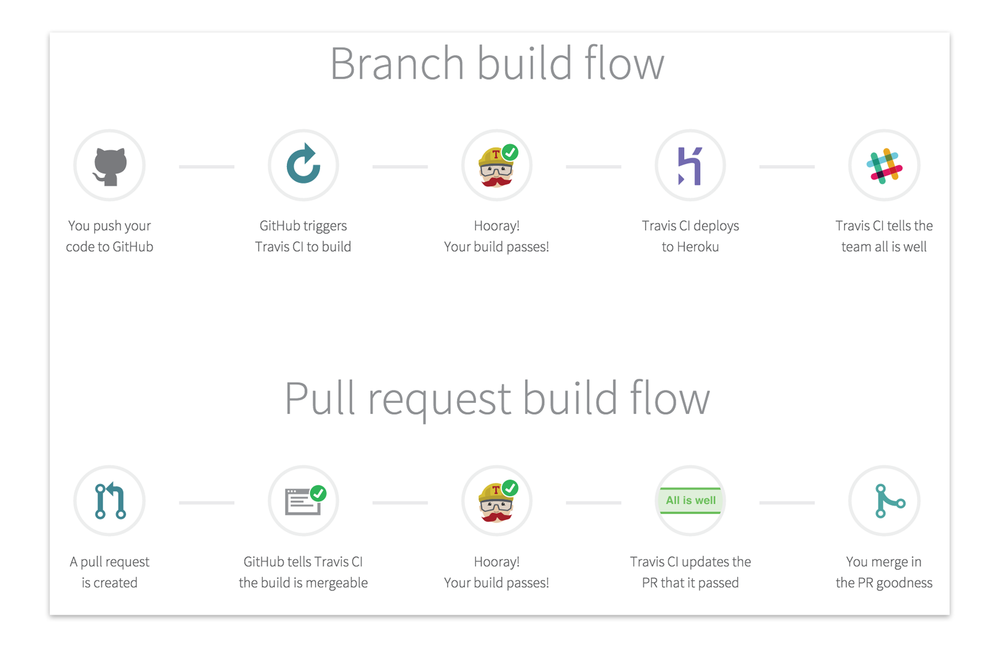

# FleCSI Continuous Integration with Docker

Continuous Integration (CI) is a development practice where developers integrate code into a shared repository frequently, preferably several times a day. Each integration can then be verified by an automated build and automated tests. While automated testing is not strictly part of CI it is typically implied.

CI merges development with testing, allowing developers to build code collaboratively, submit it the master branch, and checked for issues. This allows developers to not only build their code, but also test their code in any environment type and as often as possible to catch bugs early in the applications development lifecycle. 

Since Docker can integrate with tools like Travis-CI and GitHub, developers can submit code in GitHub, test the code and automatically trigger a build using Travis-CI, and once the image is completed successfully, images can be added to Docker registries. This streamlines the process, saves time on build and set up processes, all while allowing developers to run tests in parallel and automate them so that they can continue to work on other projects while tests are being run.

In our case, instead of Heroku, we have DockerHub.


## Setup Travis-CI for Ristra repo
In order to have Travis-CI run up-to-date automated testing, we have to
flatten the dependency chain insdie Ristra. 

The flatten sequential stack chain:

```flow
env=>start: flecsi-buildenv
third=>operation: flecsi-third-party
flecsi=>operation: flecsi
lib=>operation: libristra
flecsi-sp=>operation: flecsi-sp
flecsale=>operation: flecsale

env->third->flecsi->lib->flecsi-sp->flecsale
```

## Setup Github with Travis-CI

1. Go to https://travis-ci.org/
2. Sign in with your GitHub account
3. Authorize Travis-CI to access your repo
4. Create a `.travis.yml` file in the root of your desired repo
  * Travis configurations of your repo
  * For more info on default settings, go to [Travis Getting Started](https://docs.travis-ci.com/user/getting-started/)
5. Go to your profile on Travis-CI
6. Enable the approriate repo by flipping on their slider
7. Travis-CI now listens to your repo code changes!

## Travis-CI Configuration File `.travis.yml`

```
language: cpp

sudo: required

services:
- docker

env:
  matrix:
    - DISTRO=ubuntu_mpi BUILD_TYPE=Debug DOCKERHUB=true
    - DISTRO=fedora_mpi BUILD_TYPE=Release DOCKERHUB=true
    - DISTRO=fedora_mpich_mpi BUILD_TYPE=Release DOCKERHUB=true
    
before_install:
 - git fetch --unshallow && git fetch --tags #for versioning

script:
 - if [[ ${CC} != gcc ]]; then TAG="_${CC}"; fi
 - if [[ ${TRAVIS_BRANCH} != stable ]]; then TAG="${TAG}_master"; fi
 - cp -vr docker ${HOME}/docker
 - sed -i "1s/fedora_serial/${DISTRO}${TAG}/" ${HOME}/docker/Dockerfile
 - cd ../../
 - mv -v ${TRAVIS_REPO_SLUG} $HOME/docker
 - docker build --build-arg BUILD_TYPE=${BUILD_TYPE} 
                --build-arg CC=${CC} --build-arg CXX=${CXX}
                --build-arg TRAVIS_BRANCH=${TRAVIS_BRANCH} --build-arg TRAVIS_JOB_NUMBER=${TRAVIS_JOB_NUMBER}
                --build-arg TRAVIS_PULL_REQUEST=${TRAVIS_PULL_REQUEST} --build-arg TRAVIS_JOB_ID=${TRAVIS_JOB_ID}
                --build-arg TRAVIS_TAG=${TRAVIS_TAG} --build-arg TRAVIS_REPO_SLUG=${TRAVIS_REPO_SLUG}
                --build-arg TRAVIS_COMMIT=${TRAVIS_COMMIT}
                -t ${TRAVIS_REPO_SLUG}:${DISTRO}${TAG} ${HOME}/docker/

after_success:
  - if [[ ${DOCKERHUB} = true && ${DOCKER_USERNAME} && ${DOCKER_PASSWORD} && ${TRAVIS_PULL_REQUEST} == false && ${TRAVIS_BRANCH} == master && ${CC} = gcc ]]; then
      docker login -u="$DOCKER_USERNAME" -p="$DOCKER_PASSWORD";
      docker push "${TRAVIS_REPO_SLUG}:${DISTRO}${TAG}";
    fi

compiler:
  - gcc

```

### Explaination:

```
language: cpp
``` 

- Indicates this is a C++ project

```
sudo: required

services:
- docker
``` 

- Allows the use of `- docker` commands

```
env:
  matrix:
    - DISTRO=ubuntu_mpi BUILD_TYPE=Debug DOCKERHUB=true
    - DISTRO=fedora_mpi BUILD_TYPE=Release DOCKERHUB=true
    - DISTRO=fedora_mpich_mpi BUILD_TYPE=Release DOCKERHUB=true
``` 

- Specifies the different distribution environment and configurations that
Travis-CI is going to build and run 

- Options:

  * `DISTRO` Specifies the distribution environment
  * `BUILD_TYPE` Debug/Release or any other available build types
  * `DOCKERHUB` true/false for deploying a container to DockerHub
  * `SYSTEM_LIBS` ON/OFF for using system libraries
  * `RUNTIME` legion/mpi/hpx for specifying runtime backend
  * `WERROR` yes/no for displaying warnings
  * `IGNORE_NOCI` true/false
  * `SONARQUBE` ON/OFF
  * `COVERAGE` ON/OFF
  * `MPI` ON/OFF
  * `DOCS` true/false

```
before_install:
 - git fetch --unshallow && git fetch --tags 
```
 
- Allows for versioning

```
script:
 - if [[ ${CC} != gcc ]]; then TAG="_${CC}"; fi
 - if [[ ${TRAVIS_BRANCH} != stable ]]; then TAG="${TAG}_master"; fi
 - cp -vr docker ${HOME}/docker
 - sed -i "1s/fedora_serial/${DISTRO}${TAG}/" ${HOME}/docker/Dockerfile
 - cd ../../
 - mv -v ${TRAVIS_REPO_SLUG} $HOME/docker
 - docker build --build-arg BUILD_TYPE=${BUILD_TYPE}
                --build-arg CC=${CC} --build-arg CXX=${CXX}
                --build-arg TRAVIS_BRANCH=${TRAVIS_BRANCH} --build-arg TRAVIS_JOB_NUMBER=${TRAVIS_JOB_NUMBER}
                --build-arg TRAVIS_PULL_REQUEST=${TRAVIS_PULL_REQUEST} --build-arg TRAVIS_JOB_ID=${TRAVIS_JOB_ID}
                --build-arg TRAVIS_TAG=${TRAVIS_TAG} --build-arg TRAVIS_REPO_SLUG=${TRAVIS_REPO_SLUG}
                --build-arg TRAVIS_COMMIT=${TRAVIS_COMMIT}
                -t ${TRAVIS_REPO_SLUG}:${DISTRO}${TAG} ${HOME}/docker/
``` 

- Commands:
  
  * `- if [[ ${CC} != gcc ]]; then TAG="_${CC}"; fi` & `- if [[
    ${TRAVIS_BRANCH} != stable ]]; then TAG="${TAG}_master"; fi` allows for deployment of different containers from same repo but
different branches
  * `sed -i "1s/fedora_serial/${DISTRO}${TAG}/"
    ${HOME}/docker/Dockerfile` allows for different distribution
environments before Travis-CI updates its Docker to permit the use of
variable
  * `- cp -vr docker ${HOME}/docker` & `mv -v ${TRAVIS_REPO_SLUG}
    $HOME/docker` allows for the access of files since Docker only has access to the files within the folder that it's run

```
docker build --build-arg BUILD_TYPE=${BUILD_TYPE}
                --build-arg CC=${CC} --build-arg CXX=${CXX}
                --build-arg TRAVIS_BRANCH=${TRAVIS_BRANCH} --build-arg TRAVIS_JOB_NUMBER=${TRAVIS_JOB_NUMBER}
                --build-arg TRAVIS_PULL_REQUEST=${TRAVIS_PULL_REQUEST} --build-arg TRAVIS_JOB_ID=${TRAVIS_JOB_ID}
                --build-arg TRAVIS_TAG=${TRAVIS_TAG} --build-arg TRAVIS_REPO_SLUG=${TRAVIS_REPO_SLUG}
                --build-arg TRAVIS_COMMIT=${TRAVIS_COMMIT}
                -t ${TRAVIS_REPO_SLUG}:${DISTRO}${TAG}
${HOME}/docker/
```

Instead of pulling the Docker image, we are building
directly from the `docker/Dockerfile` in the root of repo.

- Docker building:
 
  * `--build-arg`: Specifies the environment variables within
          Docker
  * `-t`: Tags the Docker container

```
after_success:
  - if [[ ${DOCKERHUB} = true && ${DOCKER_USERNAME} && ${DOCKER_PASSWORD} && ${TRAVIS_PULL_REQUEST} == false && ${TRAVIS_BRANCH} == master && ${CC} = gcc ]]; then
      docker login -u="$DOCKER_USERNAME" -p="$DOCKER_PASSWORD";
      docker push "${TRAVIS_REPO_SLUG}:${DISTRO}${TAG}";
    fi
``` 

- If everything successfully build and run and we are on the master branch, 
by having the username and password, environment settings of
`DOCKERHUB=true`, `TRAVIS_PULL_REQUEST=false` and the gcc compiler, Travis-CI will deploy the container to DockerHub

```
compiler:
  - gcc
``` 

- Specifies the compiler

### Docker Configuration File `docker/Dockerfile`

```
FROM laristra/flecsi:fedora_serial

ARG CC
ARG CXX
ARG CXXFLAGS
ARG BUILD_TYPE

#for coverage
ENV CI true
ENV TRAVIS true
ARG TRAVIS_BRANCH
ARG TRAVIS_JOB_NUMBER
ARG TRAVIS_PULL_REQUEST 
ARG TRAVIS_JOB_ID
ARG TRAVIS_TAG
ARG TRAVIS_REPO_SLUG
ARG TRAVIS_COMMIT

COPY libristra/ /home/flecsi/libristra
USER root
RUN chown -R flecsi:flecsi /home/flecsi/libristra
USER flecsi

WORKDIR /home/flecsi/libristra
RUN mkdir build
WORKDIR build

RUN cmake -DCMAKE_BUILD_TYPE=${BUILD_TYPE} \
          -DENABLE_UNIT_TESTS=ON \
          ..
RUN make -j2 || make VERBOSE=1
RUN make test ARGS="CTEST_OUTPUT_ON_FAILURE=1"
RUN make install DESTDIR=${PWD}/install && rm -rf ${PWD}/install

USER root
RUN make install

WORKDIR /home/flecsi
```

### Explaination:

```
FROM laristra/flecsi:fedora_serial
```

As discussed above, this is how we build up the sequential chain for
Ristra repo CI testing

```
ARG CC
ARG CXX
ARG CXXFLAGS
ARG BUILD_TYPE

#for coverage
ENV CI true
ENV TRAVIS true
ARG TRAVIS_BRANCH
ARG TRAVIS_JOB_NUMBER
ARG TRAVIS_PULL_REQUEST
ARG TRAVIS_JOB_ID
ARG TRAVIS_TAG
ARG TRAVIS_REPO_SLUG
ARG TRAVIS_COMMIT
```

- `ARG` handles the passed in argument variables from `--build-arg` [It is OK for the
  values to be empty/null, but it is NOT OK to not handle them]
- `ENV` 

```
COPY libristra/ /home/flecsi/libristra
USER root
RUN chown -R flecsi:flecsi /home/flecsi/libristra
USER flecsi
```

- Get the files into the home directory and change to flecsi user

```
WORKDIR /home/flecsi/libristra
RUN mkdir build
WORKDIR build

RUN cmake -DCMAKE_BUILD_TYPE=${BUILD_TYPE} \
          -DENABLE_UNIT_TESTS=ON \
          ..
RUN make -j2 || make VERBOSE=1
RUN make test ARGS="CTEST_OUTPUT_ON_FAILURE=1"
RUN make install DESTDIR=${PWD}/install && rm -rf ${PWD}/install

USER root
RUN make install

WORKDIR /home/flecsi
```

- Make the build directory
- Run `cmake` with the correct settings
- Run `make`, `make test` and `make install`

<!-- vim: set tabstop=2 shiftwidth=2 expandtab fo=cqt tw=72 : -->
